# AI-Powered Resume Screening & Candidate Ranking System

<div align="center">


**An intelligent system that automatically analyzes resumes, extracts candidate information, evaluates suitability against job requirements, and generates a ranked shortlist of applicants.**

</div>

---

## Table of Contents

- [Overview](#overview)
- [Features](#features)
- [Tech Stack](#tech-stack)
- [Project Structure](#project-structure)
- [Installation & Setup](#installation--setup)
- [Running the Application](#running-the-application)
- [AI Scoring Methodology](#ai-scoring-methodology)
- [API Documentation](#api-documentation)
- [Screenshots](#screenshots)
- [Bonus Features](#bonus-features)

---

## Overview

Recruiters often spend significant time manually reviewing hundreds of resumes for a single position. This system addresses that problem by:

- Automatically **extracting** structured information from resume PDFs
- **Analyzing** job descriptions to identify required and preferred qualifications
- Using **AI/NLP** to match candidates against job requirements
- **Ranking** candidates with a transparent, explainable scoring system
- Providing **insights** including skill gap analysis and auto-generated interview questions

---

## Features

### Core Features
- **Resume Processing** — Upload single or multiple PDF resumes simultaneously
- **Information Extraction** — Automatically extracts Name, Email, Phone, Skills, Education, Certifications, Work Experience, and Projects using spaCy NER + regex
- **Job Description Analysis** — Parses JDs to extract required skills, preferred skills, experience requirements, and education level
- **AI Matching Engine** — 5-component weighted scoring system for transparent candidate ranking
- **Candidate Ranking** — Sorted ranked shortlist with verdict labels (Strong Fit / Good Fit / Average Fit / Low Fit)
- **Resume Summarization** — AI-generated 2-3 sentence candidate summaries using extractive NLP
- **Compare Candidates** — Side-by-side comparison with skill-by-skill grid
- **Export Results** — Download ranked candidate list as CSV

### Dashboard
- Real-time screening statistics
- Live candidate ranking with animated score rings
- AI Screening Insights (top candidates + in-demand skills analysis)
- Screening coverage tracker

### Bonus Features
- **Skill Gap Analysis** — Identifies missing required/preferred skills with coverage percentage
- **Learning Recommendations** — Suggests resources for each skill gap
- **Interview Question Generation** — Auto-generates targeted questions across 4 categories (Technical, Experience, Behavioral, Skill Gap)
- **Structured Job Requirements** — Visual display of parsed JD requirements

---

## Tech Stack

### Backend
| Technology | Purpose |
|---|---|
| **FastAPI** | REST API framework with auto-generated docs |
| **SQLite + SQLAlchemy** | Database and ORM |
| **PyMuPDF + pdfplumber** | PDF text extraction (dual-library for different resume formats) |
| **spaCy (en_core_web_sm)** | Named Entity Recognition for candidate name extraction |
| **NLTK** | Text tokenization and stopword filtering |
| **Sentence Transformers (all-MiniLM-L6-v2)** | Semantic similarity via sentence embeddings |
| **Scikit-learn** | TF-IDF keyword analysis |
| **Python 3.12** | Core language |

### Frontend
| Technology | Purpose |
|---|---|
| **React 18** | Component-based UI |
| **Vite** | Build tool and dev server |
| **Tailwind CSS v4** | Utility-first styling with custom Teyzix design tokens |
| **Axios** | HTTP client for API communication |

---

## Project Structure

```
resume-screening-candidate-ranking-system/
├── backend/
│   ├── app/
│   │   ├── models/
│   │   │   ├── candidate.py       # Candidate database model
│   │   │   ├── job.py             # Job description database model
│   │   │   └── match_score.py     # Match score database model
│   │   ├── routers/
│   │   │   ├── resumes.py         # Resume upload & candidate endpoints
│   │   │   ├── jobs.py            # Job description endpoints
│   │   │   └── matching.py        # AI scoring, ranking & export endpoints
│   │   ├── services/
│   │   │   ├── pdf_extractor.py   # PDF text extraction (PyMuPDF + pdfplumber)
│   │   │   ├── resume_parser.py   # Information extraction (NER + regex)
│   │   │   ├── jd_parser.py       # Job description analysis
│   │   │   ├── scoring_engine.py  # 5-component AI scoring engine
│   │   │   ├── semantic_matcher.py # Sentence Transformer similarity
│   │   │   ├── summarizer.py      # Extractive resume summarization
│   │   │   ├── skill_gap.py       # Skill gap analysis
│   │   │   └── interview_generator.py # Interview question generation
│   │   ├── database.py            # SQLAlchemy connection setup
│   │   └── main.py                # FastAPI app entry point
│   ├── uploads/
│   │   ├── resumes/               # Uploaded resume PDFs
│   │   └── job_descriptions/      # Uploaded JD PDFs
│   ├── sample_data/               # Sample job descriptions for testing
│   └── requirements.txt
├── frontend/
│   ├── src/
│   │   ├── components/
│   │   │   ├── Avatar.jsx         # Initials avatar component
│   │   │   ├── EmptyState.jsx     # Empty state illustrations
│   │   │   ├── Navbar.jsx         # Top navigation bar
│   │   │   ├── PageWrapper.jsx    # Page transition animation wrapper
│   │   │   ├── ScoreBar.jsx       # Horizontal score progress bar
│   │   │   ├── ScoreRing.jsx      # Animated circular score indicator
│   │   │   ├── SkillTag.jsx       # Skill chip/badge component
│   │   │   ├── Spinner.jsx        # Loading spinner
│   │   │   └── VerdictBadge.jsx   # Fit verdict label badge
│   │   ├── pages/
│   │   │   ├── Dashboard.jsx      # Main dashboard with ranking + insights
│   │   │   ├── Candidates.jsx     # Candidate list, upload, bulk delete
│   │   │   ├── CandidateProfile.jsx # Full candidate detail + AI evaluation
│   │   │   ├── Compare.jsx        # Side-by-side candidate comparison
│   │   │   ├── Jobs.jsx           # Job description management
│   │   │   ├── JobDetail.jsx      # Job description detail view
│   │   │   └── Settings.jsx       # System settings + scoring methodology
│   │   ├── services/
│   │   │   └── api.js             # Centralized API client (Axios)
│   │   ├── App.jsx                # Root component + routing logic
│   │   ├── main.jsx               # React entry point
│   │   └── index.css              # Tailwind + Teyzix design tokens
│   ├── public/
│   │   └── teyzix-logo.png        # Teyzix Core logo
│   └── package.json
└── README.md
```

---

## Installation & Setup

### Prerequisites
- Python 3.12+
- Node.js 18+
- Git

### Backend Setup

```bash
# 1. Navigate to backend folder
cd backend

# 2. Create virtual environment
python -m venv venv

# 3. Activate virtual environment
# Windows:
venv\Scripts\activate
# Mac/Linux:
source venv/bin/activate

# 4. Install Python dependencies
pip install -r requirements.txt

# 5. Download spaCy English model
python -m spacy download en_core_web_sm

# 6. Download NLTK data
python -c "import nltk; nltk.download('punkt'); nltk.download('stopwords'); nltk.download('punkt_tab')"
```

> **Note:** On first run, the Sentence Transformers model (`all-MiniLM-L6-v2`, ~80MB) will be downloaded automatically. This happens once and is cached for future runs.

### Frontend Setup

```bash
# 1. Navigate to frontend folder
cd frontend

# 2. Install Node.js dependencies
npm install
```

---

## Running the Application

You need **two terminals** running simultaneously:

### Terminal 1 — Backend Server

```bash
cd backend
venv\Scripts\activate        # Windows
# source venv/bin/activate   # Mac/Linux

uvicorn app.main:app --reload --port 8000
```

Backend will be available at: `http://localhost:8000`
Interactive API docs: `http://localhost:8000/docs`

### Terminal 2 — Frontend Dev Server

```bash
cd frontend
npm run dev
```

Frontend will be available at: `http://localhost:5173`

---

## AI Scoring Methodology

Each candidate is evaluated against a job description using a **5-component weighted scoring system**:

| Component | Weight | Method |
|---|---|---|
| **Skills Match** | 35% | Required skills (80% weight) + Preferred skills (20% weight) exact matching |
| **Semantic Similarity** | 30% | Sentence Transformer embeddings (all-MiniLM-L6-v2) cosine similarity |
| **Experience Match** | 15% | Year-range extraction from work history vs. JD minimum requirement |
| **Education Match** | 10% | Degree level ranking (Bachelor's → Master's → PhD) comparison |
| **Keyword Match** | 10% | Significant word overlap between resume and JD |

**Overall Score = Weighted sum of all 5 components (0–100)**

### Verdict Thresholds

| Score Range | Verdict |
|---|---|
| 80 – 100 | Strong Fit |
| 60 – 79 | Good Fit |
| 40 – 59 | Average Fit |
| 0 – 39 | Low Fit |

### Why This Approach?

The scoring is intentionally **explainable** — each component is independently calculated and reported, so recruiters can understand exactly why a candidate scored high or low, rather than relying on a black-box score.

---

## API Documentation

FastAPI auto-generates interactive API documentation. Once the backend is running, visit:

- **Swagger UI:** `http://localhost:8000/docs`
- **ReDoc:** `http://localhost:8000/redoc`

### Key Endpoints

| Method | Endpoint | Description |
|---|---|---|
| `POST` | `/resumes/upload` | Upload single resume PDF |
| `POST` | `/resumes/upload-batch` | Upload multiple resumes at once |
| `GET` | `/resumes/` | List all candidates |
| `GET` | `/resumes/{id}` | Get candidate details + AI summary |
| `DELETE` | `/resumes/{id}` | Delete a candidate |
| `POST` | `/jobs/upload-text` | Submit job description as text |
| `GET` | `/jobs/` | List all job descriptions |
| `GET` | `/jobs/{id}` | Get full job description details |
| `POST` | `/matching/score/{candidate_id}/{job_id}` | Score one candidate against one job |
| `POST` | `/matching/score-all/{job_id}` | Score all candidates against a job |
| `GET` | `/matching/ranking/{job_id}` | Get ranked candidate list |
| `GET` | `/matching/details/{candidate_id}/{job_id}` | Get full score breakdown |
| `GET` | `/matching/skill-gap/{candidate_id}/{job_id}` | Get skill gap analysis |
| `GET` | `/matching/interview-questions/{candidate_id}/{job_id}` | Get interview questions |
| `GET` | `/matching/export/{job_id}` | Download ranking as CSV |
| `GET` | `/matching/insights` | Get AI screening insights |

---

## Screenshots

### Dashboard
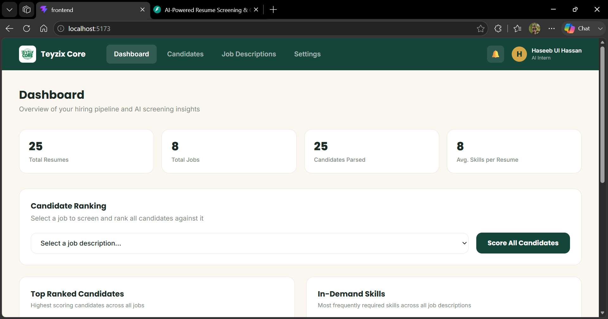
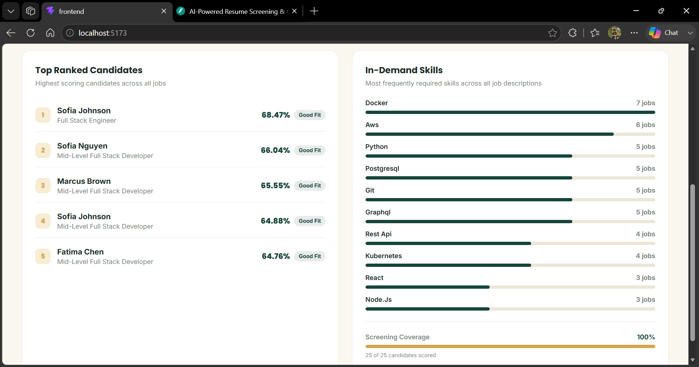

### Candidates
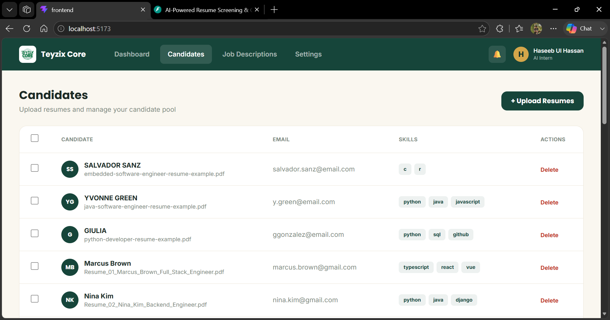

### Candidate Profile
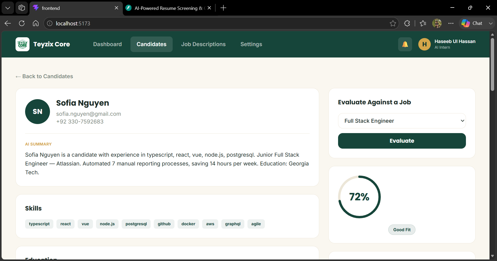
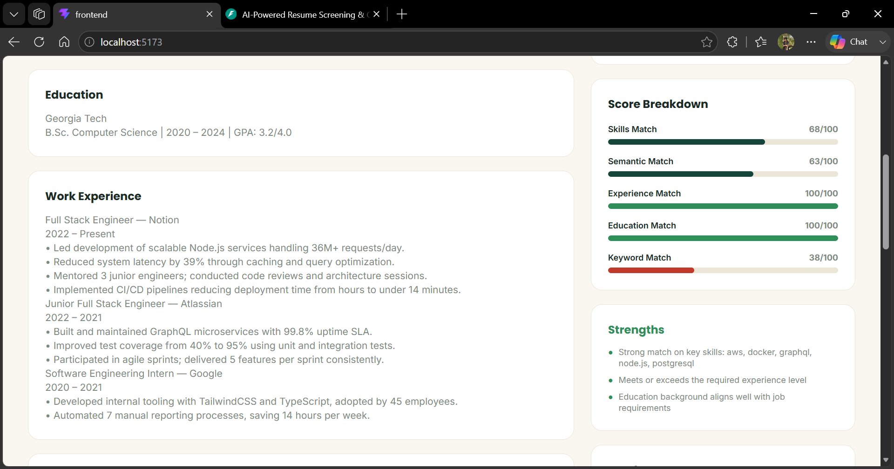
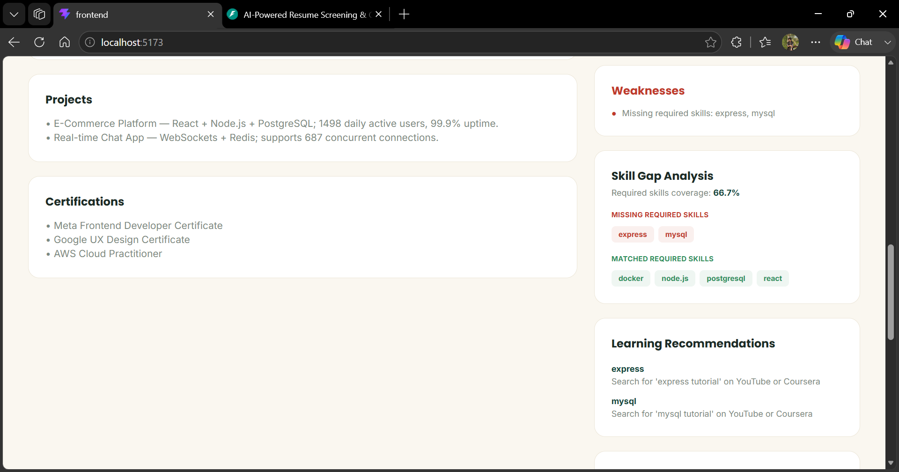
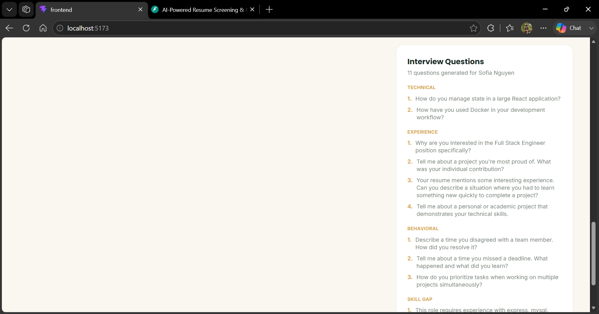

### Job Descriptions
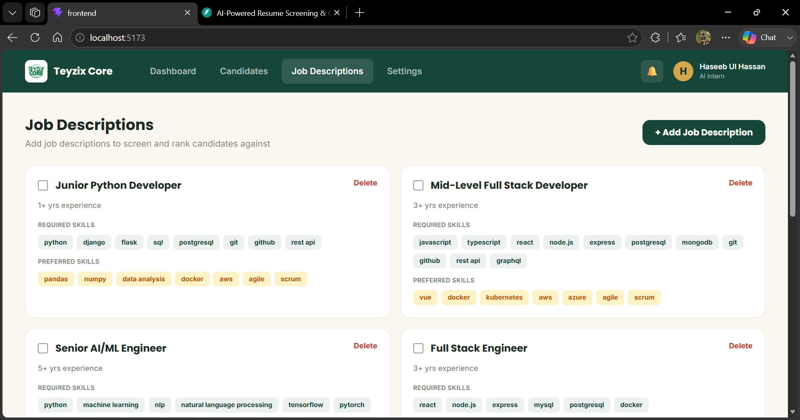
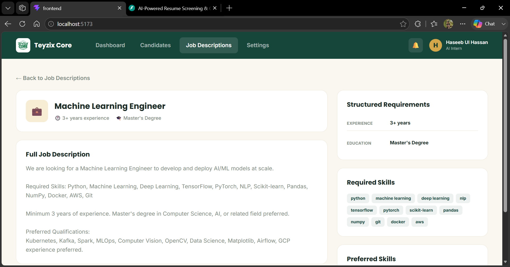
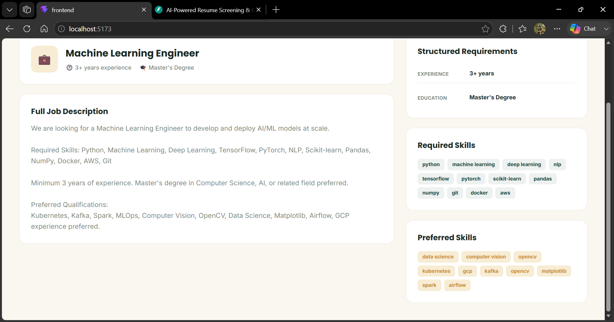

### Compare Candidates
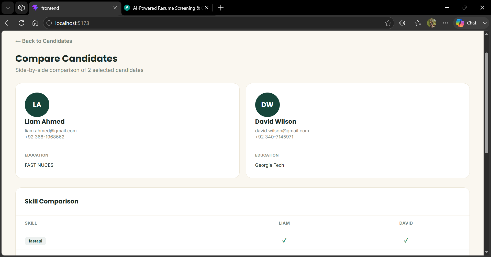
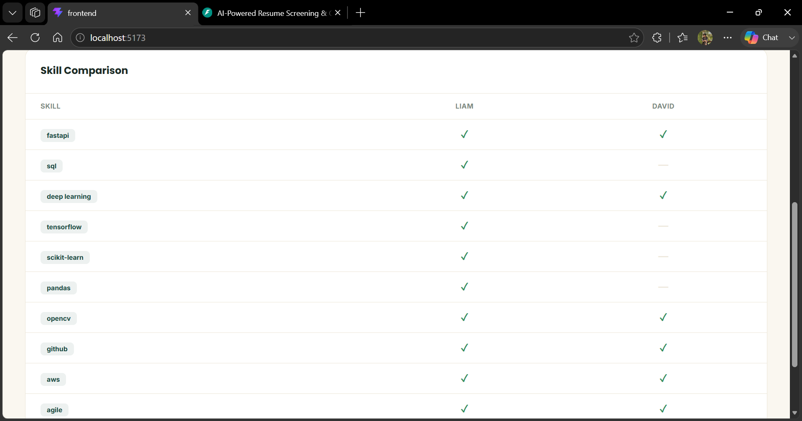

### Settings
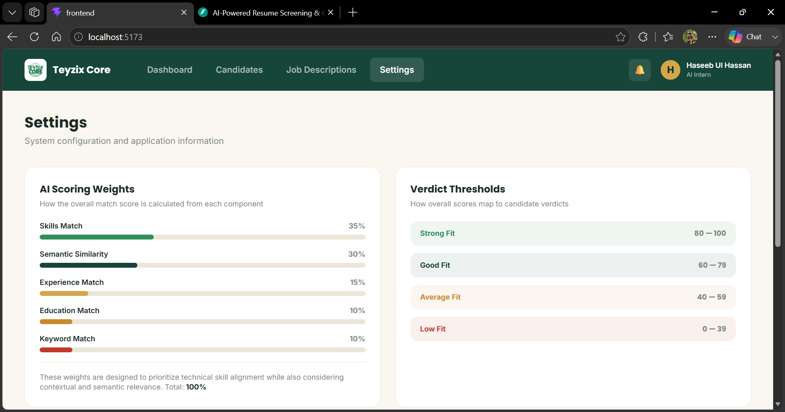
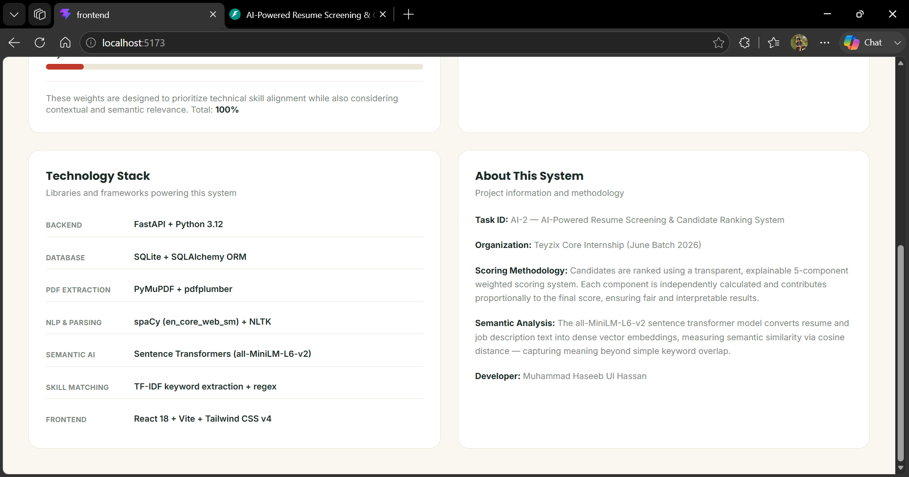

---

## Bonus Features

### Skill Gap Analysis
Compares candidate skills against job requirements and returns:
- Required skill coverage percentage
- Matched required skills (green)
- Missing required skills (red)
- Matched/missing preferred skills
- Learning resource recommendations for each gap

### Interview Question Generation
Generates targeted questions in 4 categories:
- **Technical** — Based on candidate's matched skills
- **Experience** — Tailored to the candidate's background and role
- **Behavioral** — Standard situational questions
- **Skill Gap** — Probes the candidate's awareness of their gaps

### AI Screening Insights (Dashboard)
- Top ranked candidates across all jobs
- Most in-demand skills across all job descriptions (with frequency bars)
- Overall screening coverage rate

---

## Developer

**Muhammad Haseeb Ul Hassan**
AI/NLP Intern — Teyzix Core (June Batch 2026)
- GitHub: [@haseebulhassan958](https://github.com/haseebulhassan958)
- University of Education, Lahore — BS Information Technology (AI Development)
